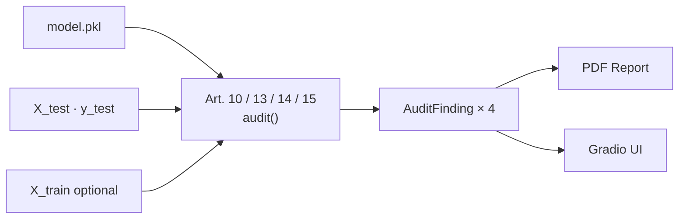

# EU AI Act Compliance Auditor

An open-source compliance auditing tool for ML systems classified as high-risk under Annex III of
Regulation (EU) 2024/1689 (the EU AI Act). The reference implementation targets **Annex III §4**:
employment, workers management, and access to self-employment — the category that covers CV
screening, candidate ranking, and automated shortlisting tools. Given a trained sklearn-compatible
model and a labelled test dataset, the auditor runs Article-by-Article checks across data
governance, transparency, human oversight, and accuracy and robustness, then produces a structured
PDF report with embedded charts and a model card. It is a developer tool, not a legal instrument.

🔗 **Live demo:** [HF Spaces link — added after deploy]

---

## Why This Matters

Regulation (EU) 2024/1689 is now in force. Prohibitions on unacceptable-risk AI applied from
6 February 2025. Rules for General-Purpose AI models apply from 2 August 2026. The full high-risk
system requirements under Annex III — including conformity assessments, technical documentation,
human oversight provisions, and post-market monitoring — apply from 2 August 2027. Companies
deploying CV screening, credit scoring, or other Annex III systems in the EU face binding
obligations under this timeline, not a future one.

There is a gap in the tooling landscape. Most ML teams are familiar with Fairlearn or AIF360 for
demographic parity checks, and with SHAP for feature importance. Few have wired these into a
structured Article-by-Article compliance pipeline that maps each metric to a specific legal
obligation, flags violations against defensible thresholds, and produces audit-ready output. This
project demonstrates one way to do that for the employment domain.

---

## What It Audits

| Article | Requirement | What is checked |
|---------|-------------|-----------------|
| **Art. 10** | Data and Data Governance | Class balance; protected-group representation; missing-value rates; Kolmogorov-Smirnov drift between train and test sets |
| **Art. 13** | Transparency and Provision of Information | SHAP global feature importance; top-5 feature explanations; auto-generated model card covering intended use, limitations, and protected attributes |
| **Art. 14** | Human Oversight | Brier score; Expected Calibration Error (ECE); low-confidence flag rate to support human reviewers |
| **Art. 15** | Accuracy, Robustness and Cybersecurity | Accuracy and F1; demographic parity difference; equalized odds difference; prediction stability under Gaussian input perturbation |

Each check produces a PASS / WARN / FAIL status against thresholds defined in
`src/auditor/constants.py`. The overall finding for each article is the worst status across its
checks.

---

## Architecture



Each article maps to one module in `src/auditor/`. Every module exposes a single function with
the same signature:

```python
def audit(model, X_test, y_test, protected_attrs) -> AuditFinding
```

`AuditFinding` is a dataclass carrying a list of `Check` objects (name, status, value, threshold,
message) and an `evidence` dict of raw numbers and chart data consumed by the PDF generator.
Neither the PDF generator nor the Gradio UI contains any audit logic.

---

## Quick Start

```bash
git clone https://github.com/prakharprakarsh/eu-ai-act-auditor.git
cd eu-ai-act-auditor
pip install -r requirements.txt
python app.py
```

The app starts at `http://localhost:7860`. Tab 1 runs an audit on the bundled synthetic hiring
model immediately. No configuration required.

Or try the live demo: [HF Spaces link — added after deploy]

---

## Project Structure

```
eu-ai-act-auditor/
├── app.py                    # Gradio UI entry point (Tab 1–3)
├── src/
│   ├── app_helpers.py        # UI orchestration: pipeline runner, badge, summary
│   ├── auditor/
│   │   ├── article_10.py     # Art. 10: data governance checks
│   │   ├── article_13.py     # Art. 13: SHAP explainability + model card
│   │   ├── article_14.py     # Art. 14: calibration + low-confidence flagging
│   │   ├── article_15.py     # Art. 15: fairness metrics + perturbation robustness
│   │   ├── base.py           # AuditFinding, Check, AuditStatus dataclasses
│   │   └── constants.py      # Pass/warn/fail thresholds — single source of truth
│   └── reports/
│       ├── charts.py         # matplotlib chart generators (PNG, no display)
│       └── pdf_generator.py  # ReportLab PDF: cover, TOC, per-article sections
├── data/processed/           # Synthetic hiring dataset (model.pkl + parquet files)
├── tests/                    # pytest suite — 77 tests across all four auditor modules
└── requirements.txt
```

---

## Extending to Other Annex III Domains

Adding a new domain — credit scoring (Annex III §5), insurance risk assessment, or law enforcement
recidivism scoring — requires only two things: a trained sklearn-compatible model and a dataset
with documented protected attributes. The four auditor modules in `src/auditor/` take any model
that exposes `predict()` and `predict_proba()`, so they work unchanged. Add the new model under
`src/models/`, provide synthetic or open data under `data/`, and wire a new Gradio tab in `app.py`
following the Tab 1 pattern. The `AuditFinding` contract and the PDF generator require no changes.
This separation — auditors know nothing about the domain, the domain knows nothing about the report
format — is the key architectural decision that makes the tool reusable across Annex III categories.

---

## Limitations

This is a developer prototype. It is not legal certification, a conformity assessment, or a
CE-marking process. Specifically:

**Scope**

- Covers Articles 10, 13, 14, and 15 of Regulation (EU) 2024/1689.
- Does not cover Article 9 (risk management system). Ongoing risk management is an organisational
  process that cannot be automated from model artefacts alone.
- Does not cover Articles 11 and 12 (technical documentation and record-keeping). The generated
  model card provides partial coverage of Article 11, but full compliance requires provider-level
  documentation packages beyond what a technical tool can produce.
- Does not cover Articles 16 and above (provider and deployer obligations, registration in the EU
  database, post-market monitoring). These are organisational and legal obligations.

**Thresholds**

The pass/warn/fail thresholds in `constants.py` — for example, flagging demographic parity
difference ≥ 0.10 as a warning — are engineering heuristics informed by fairness literature.
They are not binding regulatory standards and have not been validated by a notified body or
supervisory authority. The synthetic demo dataset was designed to exhibit detectable bias; the
thresholds are calibrated for it and may not transfer to your data without adjustment.

**Legal status**

A PASS result from this tool does not constitute compliance under Regulation (EU) 2024/1689.
It cannot be used as evidence of conformity, as a substitute for a formal conformity assessment,
or as grounds for a CE marking. The tool has not been audited or endorsed by any notified body,
national supervisory authority, or legal counsel.

Use qualified legal counsel for compliance determinations and for any representations made to
regulators, clients, or business partners.

---

## Tech Stack

Python 3.12 · scikit-learn · XGBoost · SHAP · Fairlearn · ReportLab · Gradio

---

## Author

**Prakhar Prakarsh**

- LinkedIn: [linkedin.com/in/pprakarsh04](https://www.linkedin.com/in/pprakarsh04/)
- GitHub: [github.com/prakharprakarsh](https://github.com/prakharprakarsh)

---

## License

MIT — see [LICENSE](LICENSE).
