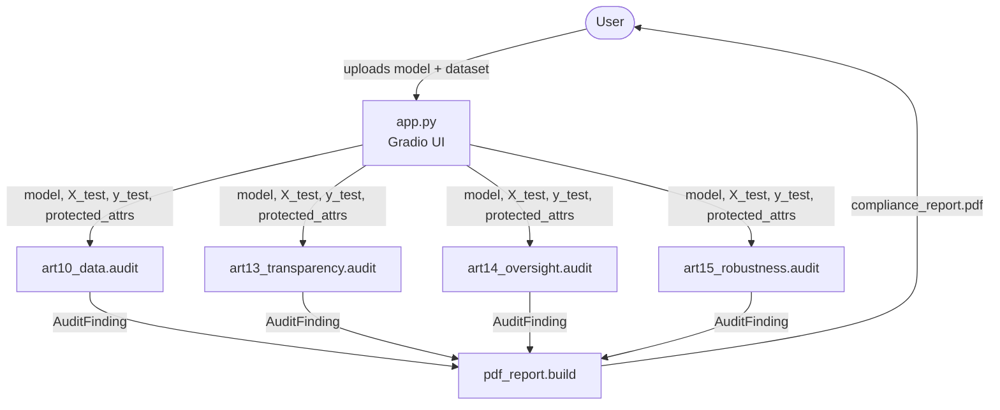

# Architecture

## Data Flow



The four auditors are independent and can run in any order. `app.py` collects all four
`AuditFinding` objects and passes them to `pdf_report.build()`.

## AuditFinding Dataclass (`src/auditor/base.py`)

```python
from dataclasses import dataclass, field
from enum import Enum

class AuditStatus(str, Enum):
    PASS = "PASS"
    WARN = "WARN"
    FAIL = "FAIL"

@dataclass
class Check:
    name: str
    status: AuditStatus
    value: float | str
    threshold: float | str | None
    message: str

@dataclass
class AuditFinding:
    article: str                          # e.g. "10"
    checks: list[Check] = field(default_factory=list)
    status: AuditStatus = AuditStatus.PASS  # worst status across checks
    evidence: dict = field(default_factory=dict)  # raw numbers, arrays, chart paths
```

`AuditFinding.status` is always the worst (most severe) status across all `checks`.
`evidence` carries anything the PDF renderer needs: numpy arrays, file paths to saved
matplotlib charts, scalar metrics.

## `audit()` Contract

Every article module in `src/auditor/` exposes exactly one public function:

```python
def audit(
    model,                        # sklearn-compatible fitted estimator
    X_test: pd.DataFrame,
    y_test: pd.Series,
    protected_attrs: dict,        # e.g. {"gender": series, "age_group": series}
) -> AuditFinding:
    ...
```

Rules:
- The function must not mutate `model`, `X_test`, or `y_test`.
- All chart files written to disk must use `pathlib.Path` and be placed under a
  caller-supplied or temp directory (never a hardcoded path).
- Thresholds come from `src/auditor/constants.py`, not inline literals.

## PDF Report Structure (`src/reports/pdf_report.py`)

`build(findings: list[AuditFinding], output_path: Path) -> Path`

Sections in order:

| # | Section | Source |
|---|---------|--------|
| 1 | Cover page | static: model name, date, risk class |
| 2 | Executive summary | worst status per article, overall verdict |
| 3 | Article 10 — Data Governance | `findings[0]` |
| 4 | Article 13 — Transparency | `findings[1]` |
| 5 | Article 14 — Human Oversight | `findings[2]` |
| 6 | Article 15 — Robustness & Fairness | `findings[3]` |
| 7 | Model Card | auto-generated from Art. 13 evidence |

Each article section renders: a status badge, a check-by-check table, and any charts
stored in `AuditFinding.evidence`.

## Gradio App Orchestration (`app.py`)

```
upload panel
  └─ model file (.pkl / .joblib)
  └─ test CSV (features + label column)
  └─ protected attribute column names (text input)

[Run Audit] button
  ├─ deserialise model
  ├─ split X_test / y_test / protected_attrs
  ├─ call audit() on all four modules
  ├─ call pdf_report.build()
  └─ return PDF download link + per-article status badges
```

The app exposes one tab per Annex III domain. The hiring domain is the reference
implementation; new domains follow the same tab pattern without touching the auditor modules.
